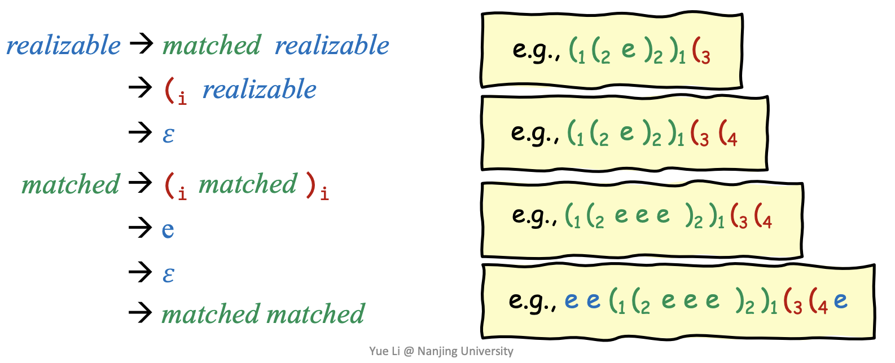
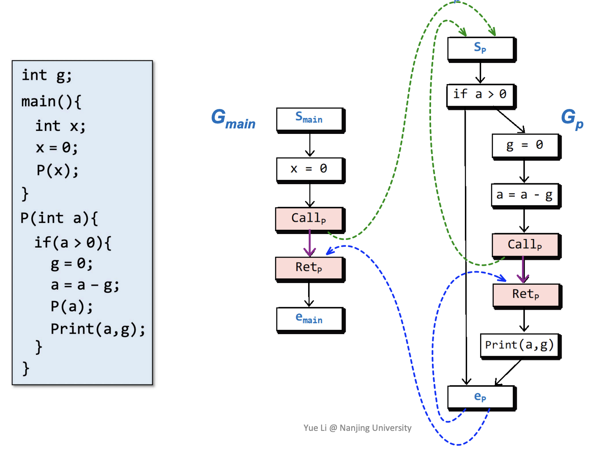
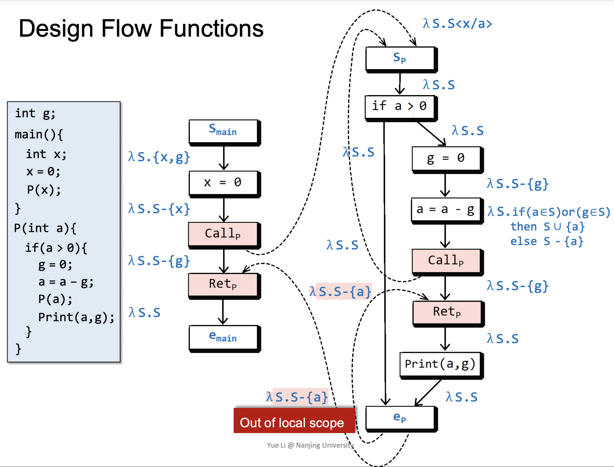
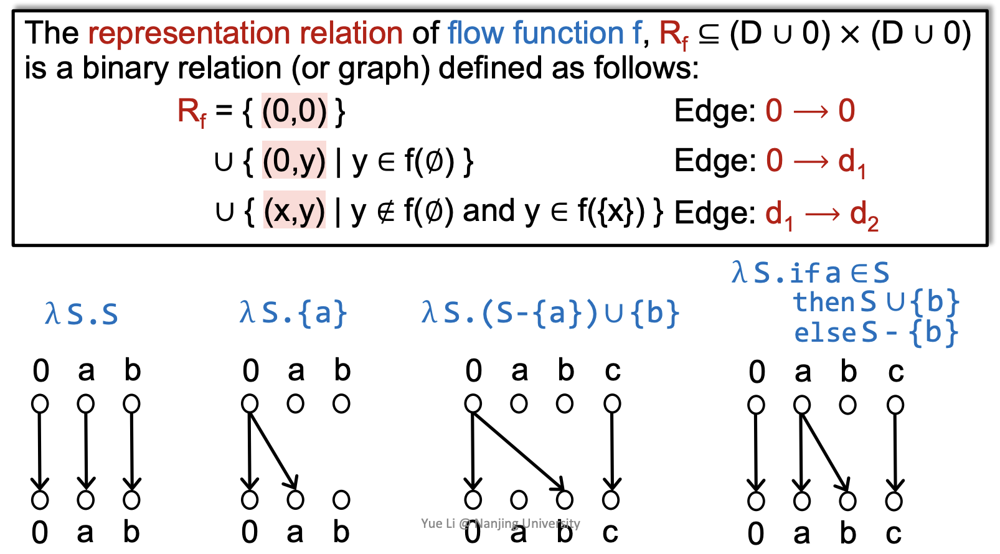
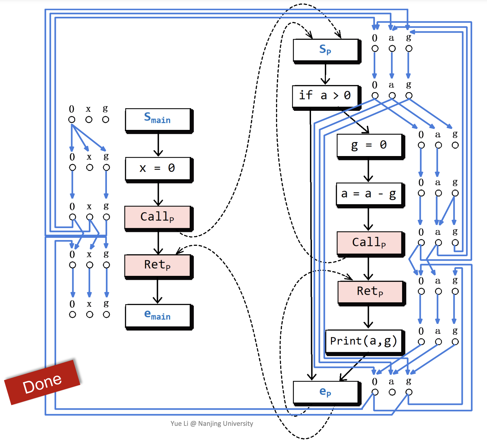
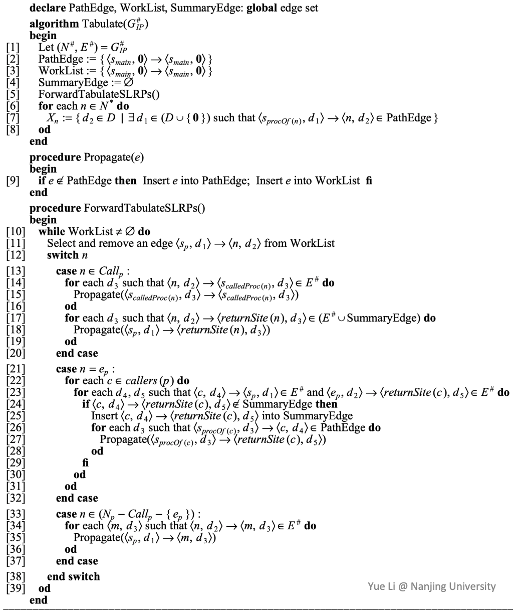
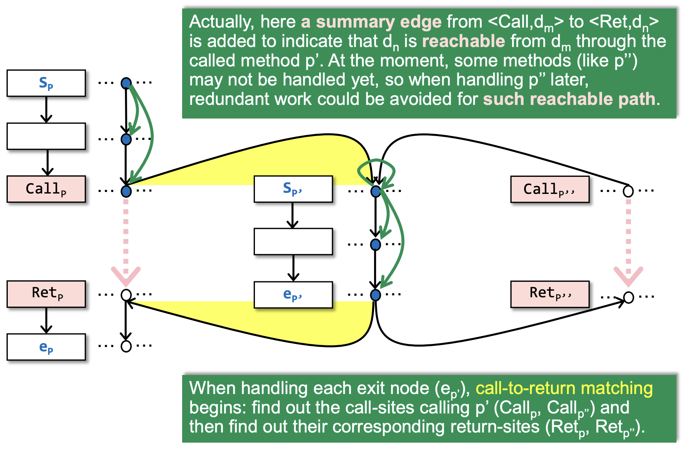
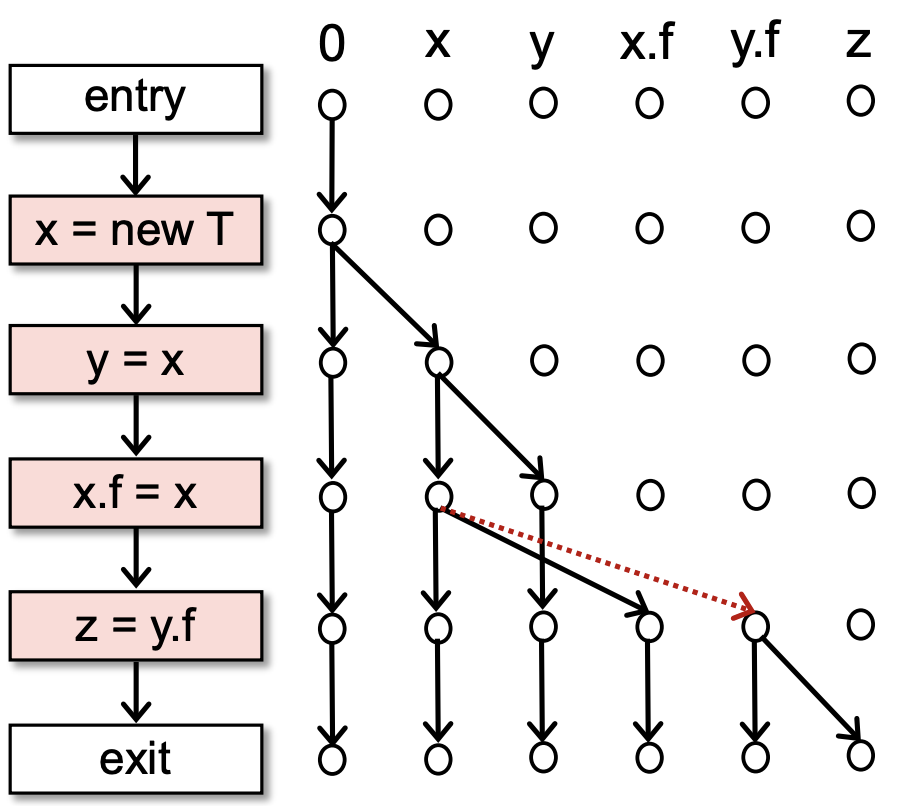

:::note[INFO]
南京大学「[软件分析](https://tai-e.pascal-lab.net/lectures.html)」课程 CFL-Reachability and IFDS 部分的学习笔记。
:::

## Feasible and Realizable Paths

infeasible paths 指的是在 CFG 并不会实际执行到的路径，例如 if 语句中某些不可能到达的分支。由于 infeasible paths 的判定与程序的 semantics 相关，所以总体上是 undecidable 的。

realizable paths 指的是 “returns” 与 “call” 相对应的路径，例子参考 slides。realizable paths 不一定是 executable 的 (feasible paths)，但是 unrealizable paths 一定不是 executable 的 (infeasible paths)。

## CFL-Reachability

使用 context sensitive 的技术可以去除 unrealizable paths，但是这里要介绍的技术是 CFL-Reachability。

CFG-reachability: A path is considered to connect two nodes A and B, or B is reachable from A, only if the concatenation of the labels on the edges of the path is a word in a specified context-free language.（懒得翻译成中文了）

CFG-reachability 其实采用的就是一种括号匹配的技术来判断 A 到 B 的路径是否合法，如果合法就说 A 到 B 有一条边，有点路径压缩的感觉🤔。

- A valid sentence in language L must follow L’s grammar.（即括号匹配的规则：左括号与右括号匹配）
- A context-free language is a language generated by a context-free grammar (CFG).

通过 CFL 解决 partially balanced-parenthesis problem：

- 每个右括号 $)_i$ 需要相应的左括号 $(_i$ 来平衡，但是左括号不需要，如下图中 realizable 的第二种可能所示
- 对于 call edge 和 return edge，我们用打上标记的左右括号来标识
- 其他的普通 edge 用 $e$ 标识

realizable 的可能形式如下图所示，matched 表示的是 fully balanced-parenthesis，可能形式如下：

## Overview of IFDS

IFDS[^1] (Interprocedural, Finite, Distributive, Subset Problem) 使用 distributive flow functions over finite domains 来解决 interprocedural dataflow analysis。

[^1]: Thomas Reps, Susan Horwitz, and Mooly Sagiv, *\"Precise Interprocedural Dataflow Analysis via Graph Reachability\"*. POPL\'95

### MRP

IFDS 提供了一种名为 meet-over all realizable paths (MRP) 的方法，与前面的 MOP 相似。

> 但是 CFG 中某些 path 是 not executable 的，也会有 unbounded、not enumerable 的路径，所以显然 MOP 是 not fully precise、impractical 的。[^2]

[^2]: [NJU「软件分析」学习笔记：Data Flow Analysis](../nju-spa-dfa/#mop-and-distributivity)

由于 MRP 针对的是 realizable paths，一些没有出口的函数都显然不会是 realizable paths，这保证了 MRP 是可以终止的、more precise than MOP、practical 的，并且可以看出 MRP $\subseteq$ MOP。

$$
\mathrm{MRP_n}=\bigcup_{p\in\mathrm{RPaths}(start, n)}pf_p(\bot)
$$

### IFDS

给定一个 program P 和一个 dataflow analysis problem Q，IFDS 解决步骤如下：

- 基于 Q 给 P 建立一个 supergraph G*，给每条边定义一个 flow function
- 将 flow function 转换为它表示的映射关系建立一个 exploded supergraph G#
- 此时 Q 已经被转化为 graph reachability problem，通过在 G# 上应用 tabulation algorithm 来解决
  - graph reachability problem: Let $n$ be a program point, data fact $d \in  \mathrm{MRP_n}$ , iff there is a realizable path in G# from $<s_{main}, 0>$ to $<n, d>$

## Supergraph and Flow Functions

### Supergraph

supergraph 以 G* = (N*, E*) 的形式表示，它由多个 flowgraph G 组成，其中每个 Gp 都表示了一个 procedure，在每一个 Gp 中都有一个 start node $s_p$ 和 exit node $e_p$，对于 procedure call，它使用一个 call node $Call_p$ 和一个 return-site node $Ret_p$ 来表示 nodes，还使用了 call-to-return-site edge (denoted by purple)、call-to-start edge (green)、exit-to-return-site edge (blue) 表示 edges。

### Design Flow Functions

以 Q = \"Possibly-uninitialized variables\": for each node n ∈ N*, determine the set of variables that may be uninitialized before execution reaches n. 为例。

flow functions 以 lambda 表达式的形式表示：$\lambda e_{param}.e_{body}$。

在 IFDS 中，我们需要针对每条边都设计一个 flow function，需要注意的是，对于 global variable $g$，在 call-to-return edge 的 flow function 中我们需要设计为 $\lambda S.S-\\{g\\}$：

- 如果 $g$ 在另一个 procedure 中被 initialize 了，那么这么做显然没问题
- 如果 $g$ 没有被 initialize，那么 call-to-return edge 和 exit-to-return edge 的 facts 合并后会加上 $g$

于是这样做可以减少 false positive 从而提高 precision。

## Exploded Supergraph and Tabulation Algorithm

### Build Exploded Supergraph

在 exploded supergraph G# 中，G* 中的每个 node 都被拆分成 D+1 个 nodes，并且 edge $n_1\to n_2$ 也会被拆分为这条边的 flow function 的 representation relation，类似于一种函数映射关系。

- default edge: $0\to 0$
- S 表示 statement
- D 表示的是 flow function 的 domain
- $\lambda S.S$ 表示 identity function，即输出 = 输入

关于为什么要加一个 0 结点，个人理解是为了减少类似于 $\lambda S.\\\{a\\\}$ 这样的恒等函数需要多连出来的很多边，于是搞一个 default 选项 0，将这 D 条边改成 $0\to a$ 这一条边从而减小时空复杂度，这样一来就有可能出现图不连通的情况，为了保证图的连通性所以每次必须加一个 $0\to 0$ 的边。

一个可能的 exploded supergraph 如下图所示。

### Tabulation Algorithm

tabulation algorithm 可以在 exploded supergraph G# 上通过找出所有的从 $<s_{main}, 0>$ 开始的 realizable paths 来给出 MRP solution，时间复杂度 $\mathcal{O}(ED^3)$。

core working mechanism:

- 在 $<Call_p, d_m>$ 和 $<Ret_p, d_n>$ 之间会有一条 summary edge (denoted by pink)，这条边用来表明 $d_n$ is reachable from $d_m$，当我们走 call-to-return edge 时就可以跳过 procedure $p$ 中的 redundant work 了
- 处理 exit node ($e_{p^1}$) 时会进行 call-to-return matching: 先找出 call $p^1$ 的 call sites，再根据 call sites 的信息找出它们分别对应的 return sites，这一步保证了 IFDS 是 context sensitive 的
- 在最开始，所有表示 data fact 的 circle 都是白色的，当一个 circle 变为蓝色的时候就表明 $<n, d>$ is reachable from $<s_{main}, 0>$（类似于染色法）

## Understanding the Distributivity of IFDS

考虑两个问题：

- IFDS 可以解决 constant propagation 吗？
  - constant propagation 的 domain 是 infinite 的，这与 IFDS 要求的 flow function 的 domain 应该是 finite 的矛盾，因此不行
- IFDS 可以解决 pointer analysis 吗？
  - 也不行，我们可以通过 IFDS 的 distributivity 来解释

用 $f(x\land y)=f(x)\land f(y)$ 可以抽象的表达 distributivity 的含义，感性理解一下吧（

观察 IFDS 的 flow function，可以发现它的输入与输出是 $1\colon n$ 的关系，而 constant propagation 的 flow function 则是 $n\colon 1$ 的关系，显然是不行的。

现在我们考虑一个简单的 pointer analysis，尝试用 IFDS 来解决这个问题，如图所示。

从图中的红边可以看出 IFDS 会漏掉 alias information，想要包含 alias information 就必然会要有 multiple inputs，这与 IFDS 的 flow functions 的设计是不符合的，所以 standard IFDS 是不能解决 pointer analysis 的。

一个简单的 rule 来判断一个问题是否能用 IFDS：对于一个 statement $s$，如果我们需要考虑 multiple input data facts 来得到正确的 output data facts，那么这个问题就不能采用 IFDS。

另外，IFDS 还有以下两个特点：

- 无后效性：每个 data fact (circle) 和它的 propagation (edges) 都可以被独立解决，也就是说，上一个 circle 或者 edge 的分析结果不会对当前这个 circle 或 edge 的分析造成影响
- 另一种意义上的「单射」：representation relation 的 rule 保证了每个 output node 最多只会被一个 input node 指向