:::note[INFO]
南京大学「[软件分析](https://tai-e.pascal-lab.net/lectures.html)」课程 Pointer Analysis 部分的学习笔记。
:::

## Introduction

### Motivation

CHA 只关注 class hierarchy 存在很大的局限性，在形如 `Number n = new One()` 的声明后调用 n 的某个 method 会得到多个 call target，实际其中只有一个 target 是真的，同时运用 constant propagation 会得到 NAC 的结果，是 inefficient 且 imprecise 的。

而 pointer analysis 是基于 point-to relation 的，不会出现上述情况。

### Introduction to Pointer Analysis

pointer analysis 是一个 fundamental 的 analysis，对于 OOPL，它需要解决的问题是一个指针可能指向哪些 object，同样也是为了 safety，使用的是一种 may-analysis (over-approximation)。

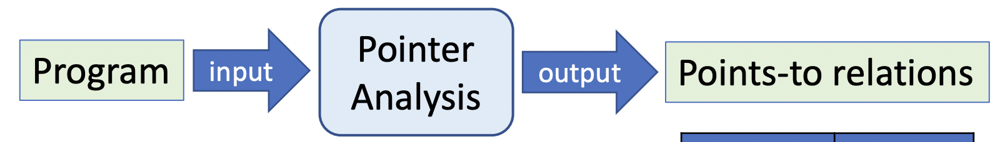

alias analysis 解决的问题是两个指针是否指向的是同一个 object，可以从 pointer analysis 中推导得出。

> \"Pointer analysis is one of the most fundamental static program analyses, on which virtually all others are built.\"[^1]

[^1]: Pointer Analysis - Report from Dagstuhl Seminar 13162. 2013.

### Key Factors of Pointer Analysis

pointer analysis 是一个较为复杂的系统性的分析，不同的 factors 会影响整个系统的 efficiency 和 precision。

factors 主要有四种：heap abstraction、context sensitivity、flow sensitivity、analysis scope。

#### Heap Abstraction

heap abstraction 解决的是 how to model heap memory 的问题。

在 dynamic execution 中，堆栈大小可能是 unbounded 的（例如 non-tail-recursion），我们的目标就是将 dynamically allocated、unbounded concrete objects 依照它们的一些共性抽象为 finite abstract objects。

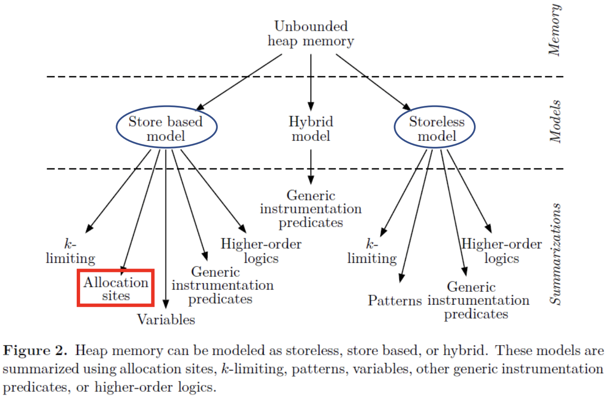[^2]

[^2]: Vini Kanvar, Uday P. Khedker, *\"Heap Abstractions for Static Analysis\"*. ACM CSUR 2016.

解决方式主要分为两大流派：store baesd 和 storeless，其中 store based model 下的 allocation sites 方法使用最为广泛。

allocation-site 依照 allocation site 来进行 abstract，可以理解为进行 allocate 的代码所在位置，如下图所示，其中 $o_2$ 表示第二行的 allocate 的 object：

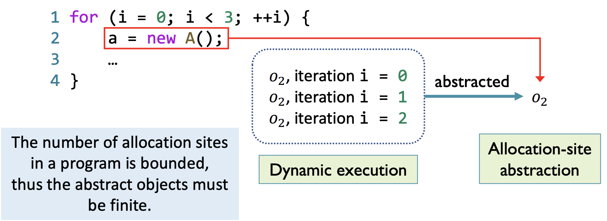

Why Allocation-Site

每一次 allocation 必然对应一个 allocation site，而 allocation sites 必然是有限的，因此可以依据这个共性来进行 abstract。

#### Context Sensitivity

context sensitivity 解决的是 how to model calling contexts 的问题。

|Context-sensitive|Context-insensitive|
|:--:|:--:|
|Distinguish different calling contexts of a method|*Merge* all calling contexts of a method|
|Analyze each method multiple times, *once for each context*|Analyze *each method once*|

context-sensitive 是非常有用的技术，而 context-insensitive 则是提高了 efficiency 但是丢掉了 precision 的技术。

#### Flow Sensitivity

flow sensitivity 解决的是 how to model control flow 的问题。

|Flow-sensitive|Flow-insensitive|
|:--:|:--:|
|Respect the execution order of the statements|Ignore the control-flow order, treat the program as a set of unordered statements|
|Maintain a map of points-to relations at *each program location*|Maintain one map of points-to relations for *the whole program*|

由于 flow-insensitive 忽略了 statements 的 order，所以下图中对 s 的求解有两个值（橙色），其中一个为 false positive。

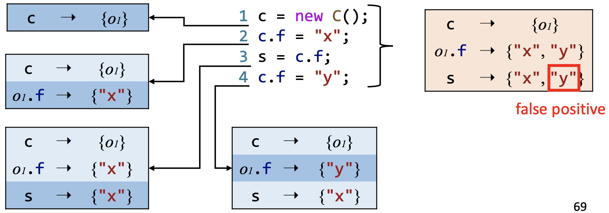

对于 C 语言，flow-sensitive 是十分有效的技术，但是对于 Java，目前没有证据表明 flow-sensitive 明显优于 flow-insensitive，并且 flow-sensitive 的开销较大，所以对于 Java 通常选择后者。

#### Analysis Scope

analysis scope 解决的是 what parts of program should be analyzed 的问题。

|Whole-program |Demand-driven|
|:--:|:--:|
|Compute points-to information for all pointers in the program|Only compute points-to information for the pointers that may affect specific sites of interest (on demand)|
|Provide information for all possible clients|Provide information for specific clients|

在 demand-driven 中对特定 clients 的求解可能需要 traverse 整个 program 的很大一部分，并且一部分 clients 的求解依赖于非 demanded clients 的求解，所以实际上 demand-driven 的 efficiency 并不见得优秀多少。

#### Pointer Analysis in This Course

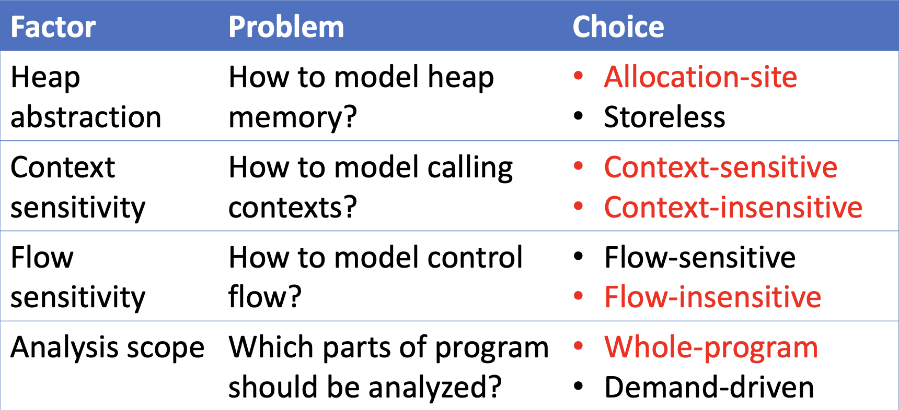

### Concerned Statements

在 pointer analysis 中，我们只关注 pointer-affecting statements。

在 Java 中，pointers 可以分为以下几类：

- local variable: `x`
- static field: `C.f` $\leftarrow$ sometimes referred as global variable
- instance field: `x.f` $\leftarrow$ modeled as an object with a field
- array element: `array[i]` $\leftarrow$ ignore indexes. modeled as an object with a *single field* (may point to any value in array)
  

  由于在实际的代码中，array 的下标往往是以变量的形式在循环中进行访问的，这在 static analysis 中是无法进行分析的，所以我们需要忽略下标抽象为一个 object with a single field 进行 may-analysis。

  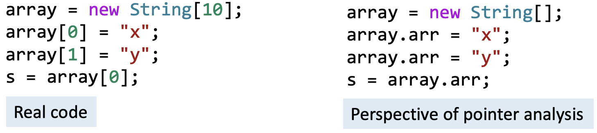
  

pointer-affecting statement 可以分为以下几类：

- new: `x = new T()`
- assign: `x = y`
- store: `x.f = y`
- load: `y = x.f`
- call: `r = x.k(a, ...)` $\leftarrow$ Complex memory-accesses will be converted to three-address code
  - focus on virtual call

## Foundations

### Rules

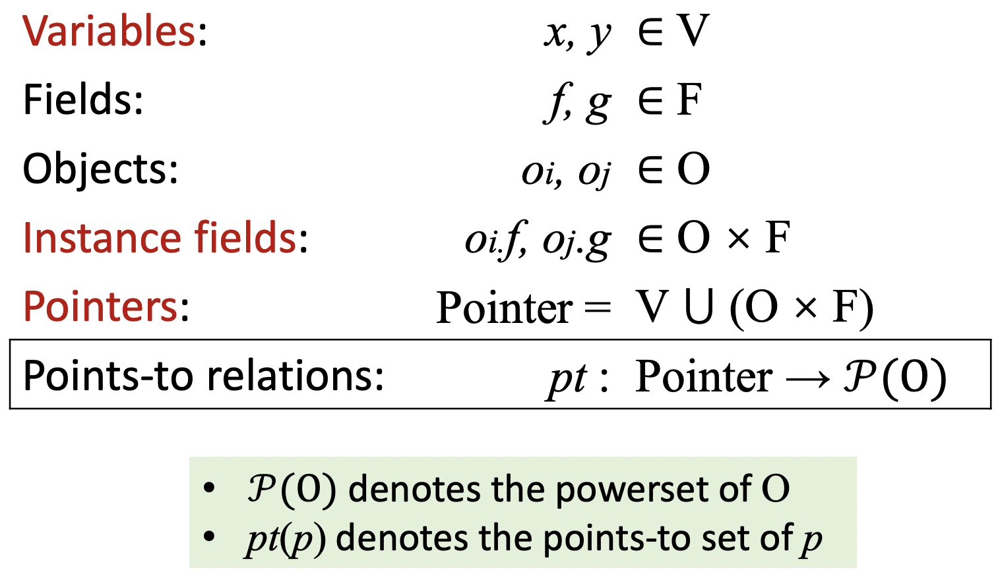

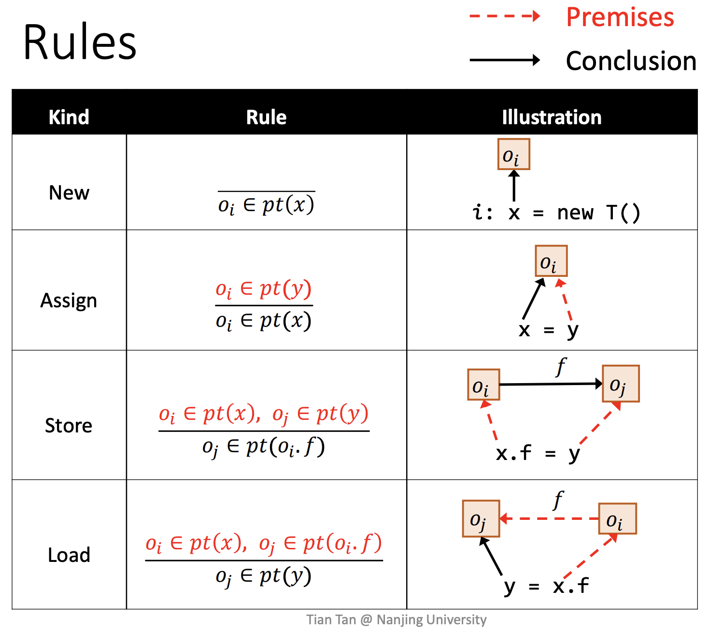

### How to Implement Pointer Analysis

pointer analysis 的本质是在 pointers 之间 propagate point-to information，所以它的关键在于当 $pt(x)$ 改变时，要如何将 changed part propagate 到相关的 pointers。

> *Andersen style analysis*: Pointer analysis as solving a system of **inclusion constraints** for pointers.[^3]

[^3]: Lars Ole Andersen, 1994. *\"Program Analysis and Specialization for the C Programming Language\"*. Ph.D. Thesis. University of Copenhagen.

类似于前面 control-flow 的解决方法，我们同样构建一张有向图，point-to information 可以通过有向边进行流动从而更新结点信息。

- nodes: Pointer = $V\cup (O\times F)$
- edges: Ponter $\times$ Pointer (may flow to)

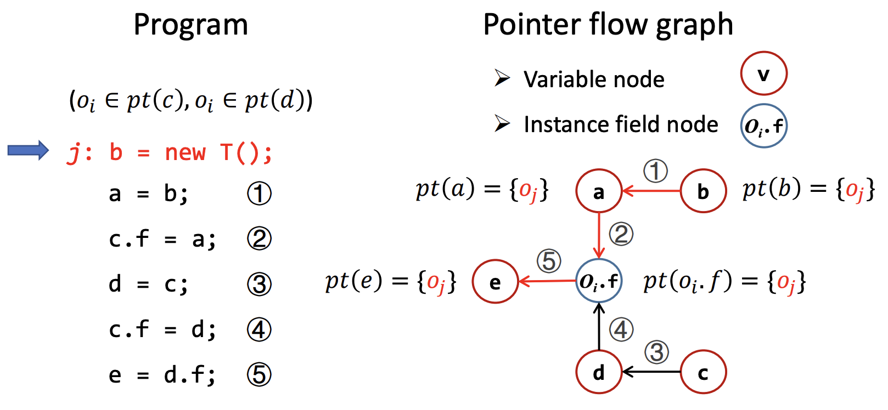

注意前面提到的这里的 pointer analysis 是 flow-insensitive 的。

对于 `c.f = a` 这种涉及 $o_i.f$ 的语句， $o_i.f$ 才是真正的 \"variable\"，因此在图上使用 $o_i.f$ 表示一个 node。

构建好 PGF 之后，pointer analysis 可以通过计算 PGF 上的 transitive closure 得到。

由于前面提到的 $o_i.f$ 在图上的表示问题（variable 和 $o_i.f$ 之间连边或者 $o.f$ 之间连边），我们可以看出来 build PFG 和 propagate point-to information on PFG 两者是互相依赖的，也就是说，PGF 是在 pointer analysis 的过程中 dynamically updated。

### Alogorithms

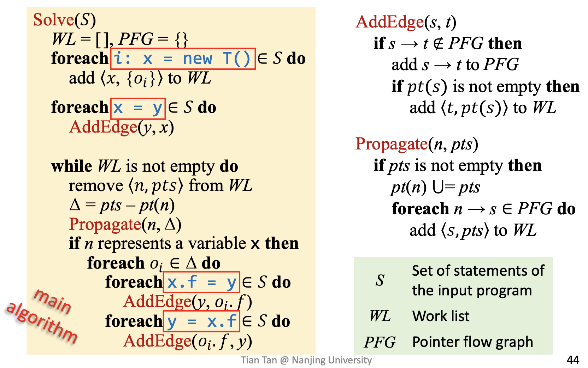

目前的这个 context-insensitive 的算法还是比较 trivial 的，仍然是一个 SPFA（那个已经死掉了的算法）的思路，不过这里将 4 个 rules 分别进行处理，analysis 和 build PGF 的过程是相互依赖的，analysis 的初始化对应 `x = new T()` rule，而 build PGF 的初始化对应 `x = y` rule，处理完之后利用 worklist 对 `x.f = y` 和 `y = x.f` 一边 analysis 一边 build。

需要注意的是这里的 differencial propagation $\Delta=pts-pt(n)$ ，这是一种在 program analysis 中常见且非常有效的方法，可以降低时间复杂度和空间复杂度。

### Pointer Analysis with Method Calls

显然，inter-procedural pointer analysis 需要建立 call graph。在 call graph 的建立上，CHA 根据 declared type of $a$ 来解决 call targets，而 pointer analysis 根据 $pt(a)$ 来判断。由前面对 CHA 的分析可以知道，CHA 会引入 spurious call graph edges 和 point-to relations。

PFG 中对于 call statement 的 rule 如下图所示。

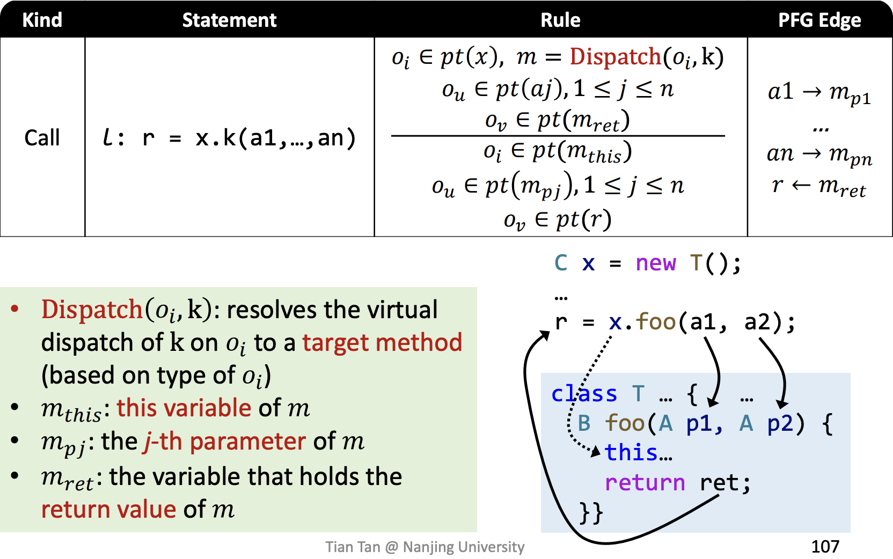

由于在 $pt(x)$ 中不同的 $o_i$ 对应的 method 可能不同，所以 PFG 中不会添加 $x\to m_{this}$ 这条边。

与 PFG 的 build 一样，call graph 和 pointer analysis 也是互相依赖、同时进行的（也被称为 on-the-fly call graph construction）。在 pointer analysis 中，call graph 形成的是一个「reachable world」，除了 entry methods 以外所有的 reachable methods 都是在 pointer analysis 的过程中逐渐发现的，并且我们只会分析 reachable methods。

pointer analysis with method calls 的算法与前面的算法大体相同，除了图中的黄色部分是新加入的。

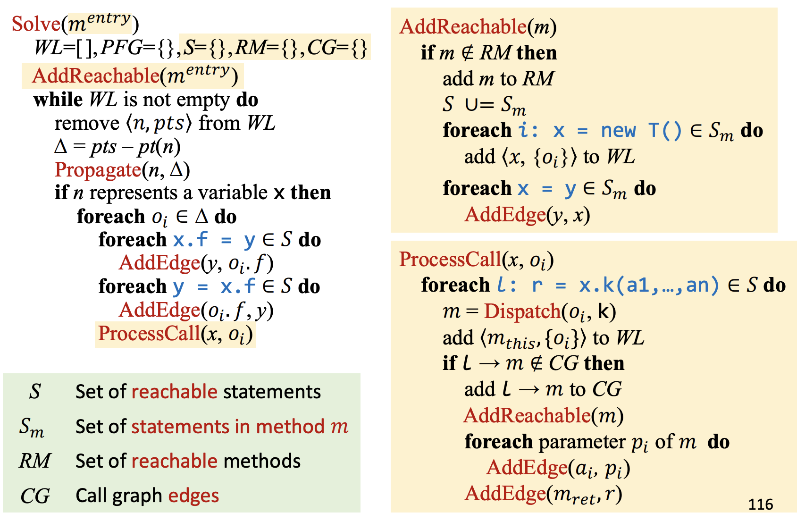

## Context Sensitivity

### Introduction

在动态执行的过程中，一个 method 可能在不同的 context 中被 call，使用 context insensitive (C.I.) 的分析方法会使得不同上下文中的不同的 object 流入一个 method 造成 spurious data flow，于是我们需要引入 context sensitive (C.S.) 的分析方法来提升精度。

C.S. 区分上下文有很多种方法，下面以 call site 方法为例。在 C.S. 中，最直接的引入上下文的分析方式是 clone-based context sensitive analysis：将 variables 和 methods 通过 contexts 进行 qualify，在每一个 context 下都维护 variables 和 methods 的 clone。

OOPs 通常是 heap-intensive 的，对于每一个 object 也用 context (heap-context) 进行 qualify，通常使用被 allocate 时的 context 作为标识。

### Rules

在 context sensitive 的分析的表示方法中，每个 domain 都加入了一维 context。

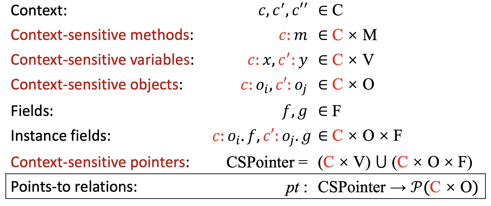

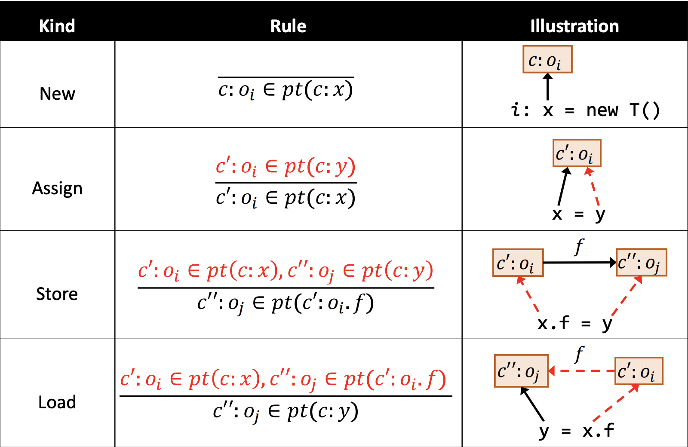

值得注意的是，在对 call 的处理中加入了一个 `Select(c, l, c': o_i)` 函数，基于 call site $l$ 时的信息来选择对应的 context

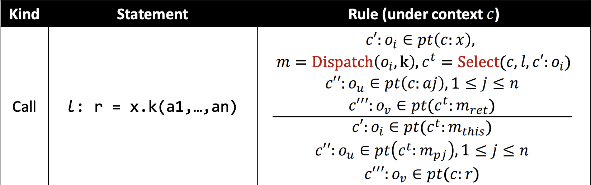

### Algorithms

context sensitive pointer analysis 其实就相当于在 C.I. 的基础上加入一维信息作为 context，同时在处理 method call 时需要使用一个 select 函数选取这个 method 的 context。

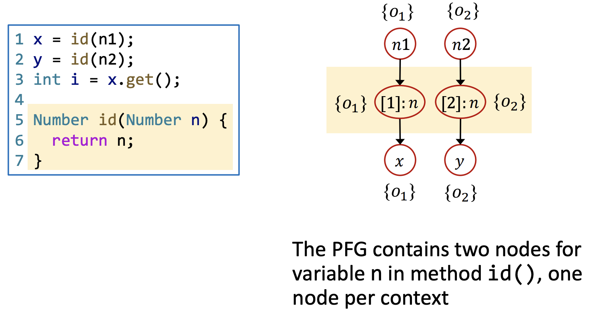

以上这张图是一个 example，如果我们将第二行的 `y = id(n2)` 改成 `x = id(n2)` 那么使用 C.S. 方法分析得到的 i 可能的 pointers 中仍然会有 spurious target，这种问题对应的则是 flow sensitivity。

C.S. 的算法如下：

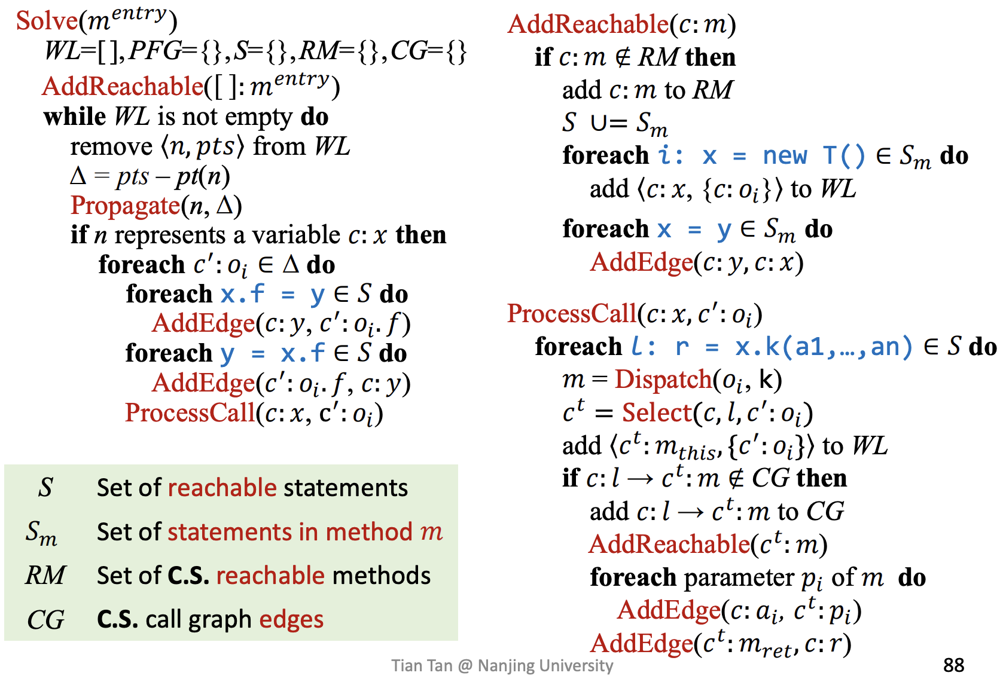

可以看出 C.S. 的处理方法和 C.I. 的处理方法几乎一致，而 `AddEdge` 和 `Propagate` 更是一样。

### Context Sensitivity Variants

context sensitivity variants 可以有很多种，这里仅仅介绍了 call-site、object、type 这三种。

#### Call-Site Sensitivity[^4]

[^4]: Olin Shivers, 1991. *\"Control-Flow Analysis of Higher-Order Languages\"*. Ph.D. Dissertation. Carnegie Mellon University.

在 call-site sensitivity 中，context 被看作是一系列 call sites 组成的 stack (call chain)，每次进入一个 method call 就将这个 call site 加入 stack 中然后传入这个 method（相当于 select 得到的结果就是原来的 call chain 加上当前的 call site）。

call-site sensitivity 也被称为 call-string sensitivity 或者 $k$-CFA。

当遇到非 tail-recursion 的递归函数时，call-site sensitivity 可能会得到一串很长的 call chain，甚至可能会出现 unbounded 的 call chain 从而导致 PA 无法 terminate。但是，真正起作用的 call sites 终究是 bounded 的，因此我们通过限制 call chain 的最大长度（$k$）来避免出现这种情况。

在实际中，$k$ 往往是一个很小的数（$\le 3$），并且 method context 和 heap context 的 $k$ 可能不同，例如 $k_{\mathrm{method}}=2, k_{\mathrm{heap}}=1$。

C.I. vs. C.S.(1-Call-Site)

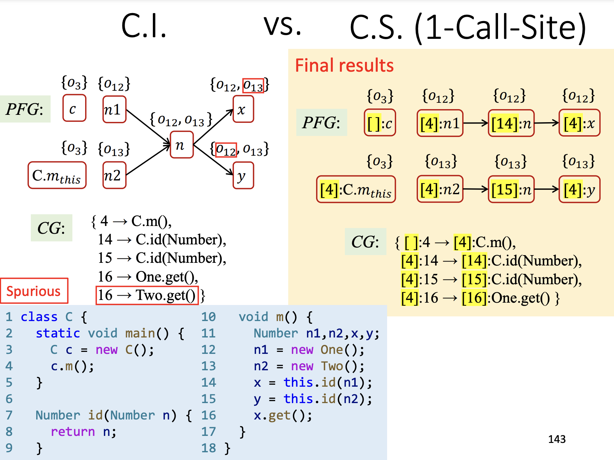

#### Object Sensitivity[^5]

[^5]: Ana Milanova, Atanas Rountev, and Barbara G. Ryder. *\"Parameterized Object Sensitivity for Points-to and Side-Effect Analyses for Java\"*. ISSTA 2002.

在 object sensitivity 中，将一系列的使用 allocation site 表示的 objects 作为 context，每次遇到一个 method call 就将 receiver object 加到它的 heap context 后面作为这个 method 的 context。

与 call-site sensitivity 不同的是，object sensitivity 针对的是流入每个 object 的 data，可以说 object sensitivity 是针对 OOPLs 设计的方法，由于使用 allocation site 来识别一个 object，所以它本质上是一种 allocation-site sensitivity。

C.S. (1-Object) vs. C.S. (1-Call-Site)

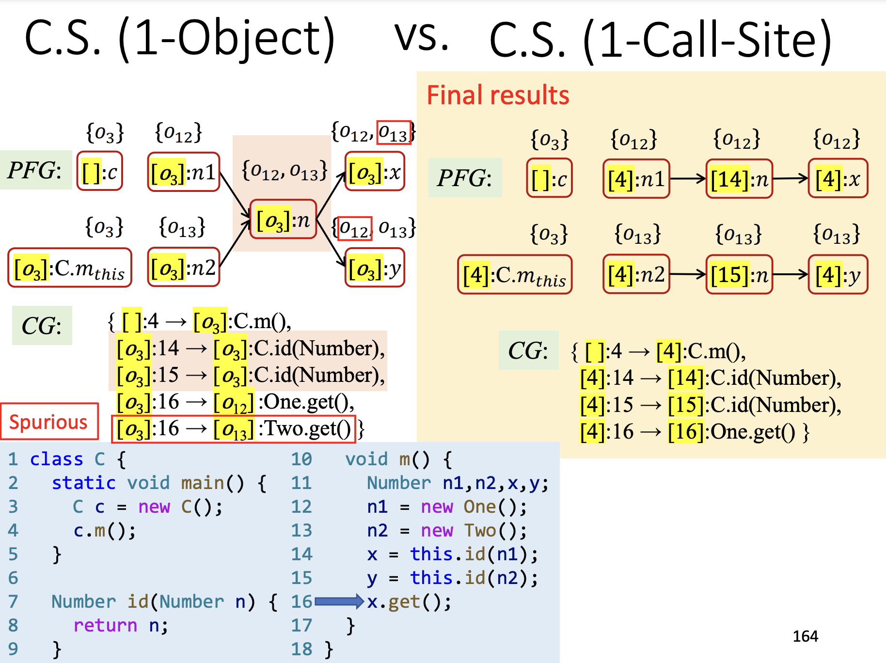

不同情况下他们的 precision 也会不同，因此这两种方法不能直接进行比较，但是在大量的数据之下进行对比，object sensitivity 对于 Java 这样的 OOPLs 是要优于 call-site sensitivity 的，考虑到 Java 的特性，并且 object sensitivity 针对的是 OOPLs，所以这也是很 intuitive 的嘛。（也许可以认为是 object sensitivity 一定程度上丢失了 generalization 但是换来了在 OOPLs 上更好的性能🤔）

#### Type Sensitivity[^6]

[^6]: Yannis Smaragdakis, Martin Bravenboer, and Ondrej Lhoták. *\"Pick Your Contexts Well: Understanding Object-Sensitivity\"*. POPL 2011.

type sensitivity 将 context 看作是一系列包含了 allocation-site of the receiver object 的 type 的集合，很显然它的精度一定是严格小于等于 object sensitivity 的，相当于一种将在同一个 class 下 allocate 的 objects 合并了的一种 object sensitivity，但是尽管丢失了精度，它换来了更好的速度。

#### Call-Site vs. Object vs. Type Sensitivity

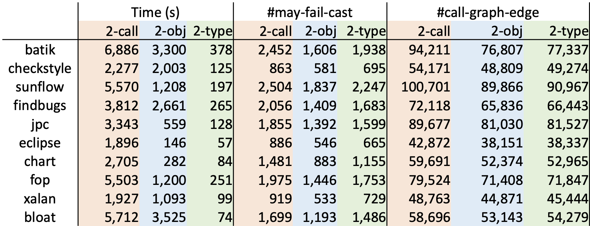[^7]

[^7]: Yue Li, Tian Tan, Anders Møller, and Yannis Smaragdakis. *\"A Principled Approach to Selective Context Sensitivity for Pointer Analysis\"*. TOPLAS 2020.

三者对比之下，可以看出 type sensitivity 仍然是由于 call-site sensitivity 的。

- Precision: object > type > call-site
- Efficiency: type > object > call-site